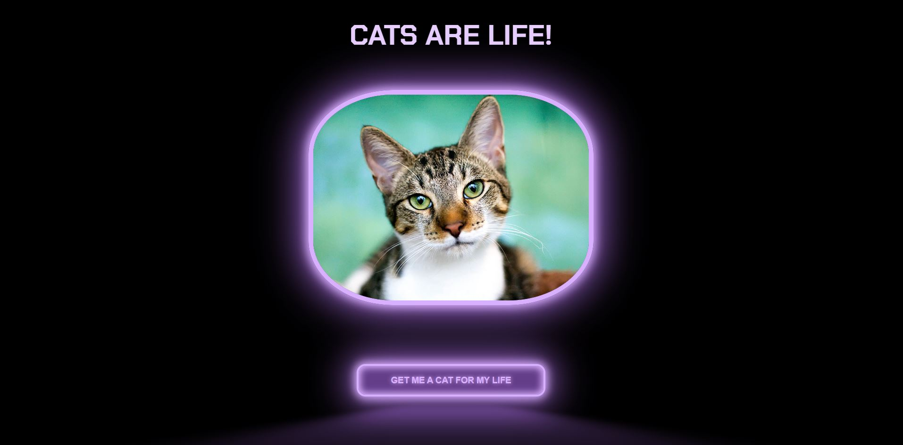

# Hackathon

This week 8 Hackathon focussed on creating a full stack React app.

## The Brief

We had to choose at least one API to fetch from in a full stack React app, using the API's documentation and sending test requests from Postman to decide if it was suitable to use.

Once we'd chosen an API, we were tasked with using Disney ideation to come up with an idea of what we wanted to build, determining our MVP - and at the end of the day we had to present our app in a group retrospective, discussing what we'd done well, what we'd learned, and what we might do differently given the chance to start over.

## The Build



We decided to use [The Cat API](https://thecatapi.com/) and created a cat pic generator that would fetch cat pictures on button click.

This was a simple idea meant to give an easy enjoyable experience - and both Neemo and I agreed that we've since used this more than any other app we've built thus far!

The style of the app is cool and modern, against the cat-lover stereotypes. We implemented a neon effect button from [uiverse](https://uiverse.io/) and then extrapolated some of the CSS to give a similar effect to the image border, pulling the site together and making the two elements more visually cohesive.

## The Cat API

- [The Cat API](https://thecatapi.com/)

```js
// fetch a random cat picture
fetch("https://api.thecatapi.com/v1/images/search");
```

## Tech

This app uses:

- React
- HTML
- JavaScript/JSX
- CSS

## Contributors

- [@lalicia](https://www.github.com/lalicia)
- [@NeemoDab](https://www.github.com/NeemoDab)
